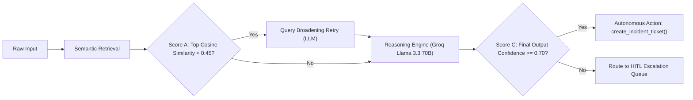

# Vertical 1: Post-Incident Knowledge Synthesis Agent
## Technical & Evaluation Tuning Report

### 1. Executive Summary
- **Vertical Domain:** Post-Incident Knowledge Synthesis
- **Category:** Precedent Detection (identifying recurring failure patterns across disparately phrased historical incident reports)
- **Primary Deliverables:**
  - Section-aware postmortem chunker (`chunker.py`)
  - 3 Domain tools: `lookup_incidents_by_service`, `get_incident_details`, and `create_incident_ticket` (`tools.py`)
  - LangGraph orchestration pipeline with retrieval retry, LLM reasoning, confidence-gating, and runtime precedent persistence (`graph.py`)
  - Synthetic test corpus with planted recurring root causes (`uploads/staging/post_incident/`)
  - Seeding utility (`seed.py`)
  - Verification & Smoke test suite (`tests/`)

---

### 2. Chunking Strategy & Granularity Decisions

#### Section-Aware vs. Fixed-Size Chunking
In naive RAG pipelines, documents are divided into arbitrary token-window slices (e.g., 500 characters with 50-character overlap). For technical incident postmortems, this naive approach fails catastrophically because:
1. Critical causal narratives (e.g., in `## Root Cause` or `## Mitigation`) get split across chunk boundaries, losing the essential link between symptom and underlying failure mechanism.
2. Slices from the middle of a document lose the global incident context (what service failed, on what date, at what severity).

#### Our Solution: Section-Aware Extraction with Header Prepending
- **Granularity:** Document sections identified by markdown headings (`## Summary`, `## Timeline`, `## Root Cause`, `## Impact`, `## Mitigation`, `## Lessons Learned`).
- **Header Prepending:** The incident metadata block (`# Incident: [Title]`, `Date: ...`, `Service: ...`, `Severity: ...`) is parsed and prepended to **every single chunk**.
- **Vector Space Advantage:** Every vector representation preserves the entity identifiers (`service`, `severity`) alongside the local narrative, ensuring similarity matches preserve microservice attribution even if only the root-cause chunk is surfaced.
- **Fallback Guarantee:** Unstructured postmortems gracefully degrade to paragraph-based chunking with the extracted header prepended.

---

### 3. Dual-Confidence Calibration & Gating Model

A central architectural requirement of the platform is decoupling the **retrieval quality score** from the **agent's final judgment confidence**:



| Metric | Threshold | Signal Source | Governed Decision | Failure / Fallback Mode |
| :--- | :--- | :--- | :--- | :--- |
| **Score A (Retrieval Gate)** | `0.45` | pgvector cosine similarity ($1 - \text{cosine\_distance}$) | Whether the initial search query is too narrow/parochial, requiring LLM query broadening. | Capped at **exactly 1 retry**. If the second pass is still $< 0.45$, proceeds to reasoning with best-effort context. |
| **Decision B (Tool Call)** | Heuristic | LLM Reasoning & Prompt Guidance | Whether to execute auxiliary read tools (`lookup_incidents_by_service`, `get_incident_details`). | Guided by service name extraction; skipped if no clear service is referenced. |
| **Score C (Action Gate)** | `0.70` | Calibrated LLM Output (`confidence` field in JSON output) | Whether to fire autonomous write action (`create_incident_ticket`) or escalate to Human-In-The-Loop queue. | If $< 0.70$ or JSON unparseable, routes to `escalations` table with detailed diagnostic reason. |

---

### 4. Tool-Calling Heuristic & Prompt Design

#### Prompted Heuristic
The LLM is guided by strict system prompts rather than static rule engines:
- When an incident report mentions a microservice (e.g., `payments-service`, `auth-service`), the model is instructed to invoke `lookup_incidents_by_service(service)`.
- If a candidate precedent ID is discovered with partial details, the model invokes `get_incident_details(incident_id)`.
- The model must output strict, unadorned JSON adhering to the specified schema:
  ```json
  {
    "confidence": 0.85,
    "root_cause_tag": "connection_pool_exhaustion",
    "linked_incident_ids": ["..."],
    "ticket_title": "Remediate recurring HikariCP pool exhaustion in payments-service",
    "should_create_ticket": true,
    "reasoning": "Both incidents exhibit connection leaks during network timeouts caused by missing cleanup in transaction handlers."
  }
  ```

#### Safety Principle: Scoped, Additive, Reversible Write Actions
- `create_incident_ticket` creates a new row in `incident_tickets` with status `open`.
- It **never mutates or deletes** existing incident records, ensuring zero data loss risk.
- If a ticket is created in error, it can be marked `closed` or `rejected` without side effects.

---

### 5. Runtime Persistence & The Learning Feedback Loop
Per Section 6.4 & Section 8.1 Step 8, newly submitted and analyzed postmortems bypass the static staging directory and are embedded directly into the shared knowledge base (`embeddings` with `vertical='post_incident'` and `source_type='postmortem'`).
- This closes the learning loop: every new incident analyzed becomes instant precedent for future incident reports submitted minutes later.

---

### 6. Synthetic Staging Corpus & Planted Test Scenarios

The reference KB in `uploads/staging/post_incident/` contains 5 realistic SRE postmortems with deliberately planted recurring root causes:

1. **`2024-03-15-payments-db-pool-exhaustion.txt`** (`payments-service`, P1): HikariCP pool exhaustion under retry storms due to missing transaction cleanup.
2. **`2024-05-22-auth-token-storm.txt`** (`auth-service`, P1): Thundering herd on token refresh endpoint causing Redis CPU saturation.
3. **`2024-07-10-redis-cache-oom.txt`** (`catalog-service`, P2): Uncapped memory growth due to missing TTLs and `volatile-lru` eviction misconfiguration.
4. **`2024-09-03-payments-timeout-cascade.txt`** (`payments-service`, P1): Downstream gateway latency triggering connection pool lockups and cascading 504 timeouts. *(Planted recurring match with Incident #1!)*
5. **`2024-11-18-deploy-rollback-failure.txt`** (`deploy-service`, P2): Schema migration lock conflict during blue-green deployment rollback.
